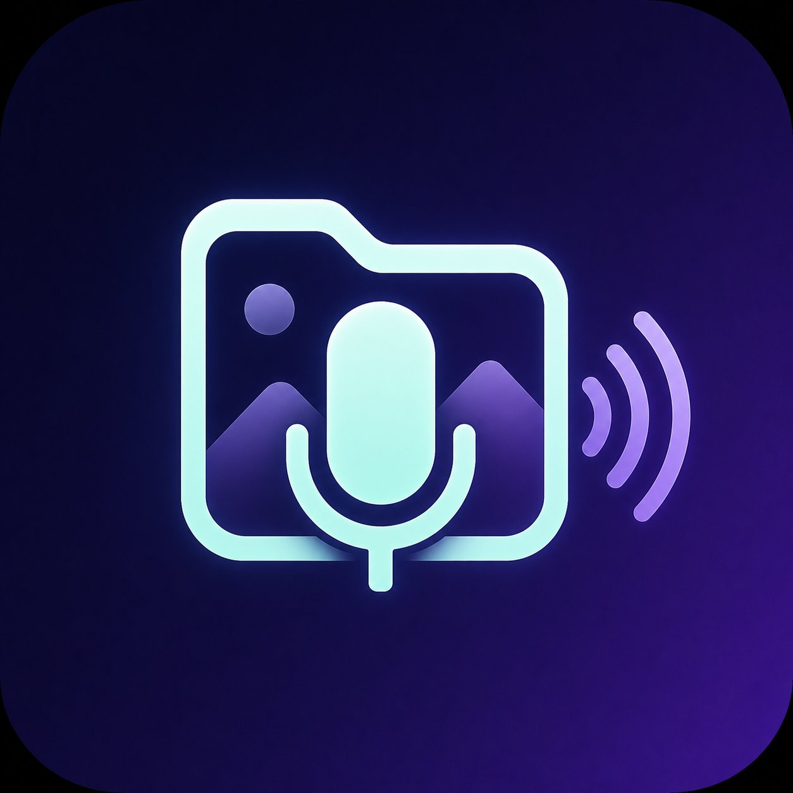

<div align="center">
  
  
  # VoiceTag
  
  **Sort hundreds of photos in minutes — just speak.**
  
  [](https://apple.com/macos)
  [](https://swift.org)
  [](LICENSE)
  [](https://claude.ai)
</div>

---

Ever come back from a trip with 500 photos and dreaded sorting them? VoiceTag lets you blaze through your photo library using just your voice. Hold SPACE, say where the photo belongs, and it moves instantly. No clicking, no dragging, no slow manual renaming.

---

## Demo

```
📂 Open folder with 500 photos from your trek

→ Browse with arrow keys
→ Hold SPACE → say "Himalayan Trek Day 2"
→ Release SPACE
→ Photo instantly moves to ~/Pictures/VoiceTagged/Himalayan_Trek/day_2/
→ Next photo loads automatically

Repeat at full speed. Sort 200 photos in 15 minutes.
```

---

## Features

- 🎙 **Voice tagging** — hold SPACE, speak, release. Done.
- ⚡ **Instant** — whisper.cpp with Metal GPU, transcription in ~200ms on Apple Silicon
- 🔁 **Shift+Space** — repeat last tag without speaking again
- ↩️ **Smart undo** — press ← right after a tag to undo it and re-tag
- 🏷 **Recent tags** — one-click sidebar buttons for your most-used tags
- 📂 **Auto folders** — "Himalayan_Trek" creates nested `Himalayan_Trek/Day_2/` automatically
- 📴 **Offline** — works completely without internet after setup
- 🗂 **EXIF aware** — shows date taken, camera model, GPS in sidebar
- 📝 **Full log** — every action logged to `~/.voicetag/voicetag.log`

---

## Installation

### Requirements
- macOS 14 (Sonoma) or later
- Apple Silicon or Intel Mac
- [Homebrew](https://brew.sh) (for ffmpeg)
- Xcode Command Line Tools: `xcode-select --install`

### Step 1 — Install ffmpeg
```bash
brew install ffmpeg
```

### Step 2 — Clone and run setup
```bash
git clone https://github.com/YOUR_USERNAME/voicetag.git
cd voicetag
chmod +x setup.sh
./setup.sh
```

This will:
- Build whisper.cpp with Metal GPU acceleration
- Download the `base.en` model (~150MB)
- Create your config at `~/.voicetag/config.json`

### Step 3 — Build and launch
```bash
swift build -c release

mkdir -p VoiceTag.app/Contents/MacOS
mkdir -p VoiceTag.app/Contents/Resources

cp .build/release/VoiceTag VoiceTag.app/Contents/MacOS/

cat > VoiceTag.app/Contents/Info.plist << 'PLIST'
<?xml version="1.0" encoding="UTF-8"?>
<!DOCTYPE plist PUBLIC "-//Apple//DTD PLIST 1.0//EN" "http://www.apple.com/DTDs/PropertyList-1.0.dtd">
<plist version="1.0">
<dict>
    <key>CFBundleExecutable</key><string>VoiceTag</string>
    <key>CFBundleIdentifier</key><string>com.voicetag.app</string>
    <key>CFBundleName</key><string>VoiceTag</string>
    <key>CFBundleVersion</key><string>1.0.0</string>
    <key>CFBundleShortVersionString</key><string>1.0.0</string>
    <key>CFBundlePackageType</key><string>APPL</string>
    <key>CFBundleIconFile</key><string>VoiceTag</string>
    <key>LSMinimumSystemVersion</key><string>14.0</string>
    <key>NSMicrophoneUsageDescription</key><string>VoiceTag uses the microphone to capture your spoken tags.</string>
    <key>NSPrincipalClass</key><string>NSApplication</string>
    <key>NSHighResolutionCapable</key><true/>
</dict>
</plist>
PLIST

open VoiceTag.app
```

### Step 4 — Grant permissions
When the app opens, grant:
- **Microphone** — System Settings → Privacy & Security → Microphone → VoiceTag ✓
- **Accessibility** (optional, for global hotkeys) — System Settings → Privacy & Security → Accessibility → VoiceTag ✓

---

## How to Use

### Keyboard Shortcuts

| Key | Action |
|---|---|
| `← →` | Navigate between images |
| Hold `SPACE` | Start recording your tag |
| Release `SPACE` | Stop recording and apply tag |
| `Shift + SPACE` | Repeat last tag instantly |
| `←` after tagging | Undo last tag, re-tag the image |
| `⌘O` | Open a folder |
| `⌘Z` | Undo last action |

### Voice Commands

| Say | What happens |
|---|---|
| `"Himalayan_Trek"` | Moves to `Himalayan_Trek/Day_2/` |
| `"family"` | Moves to `Family/` |
| `"skip"` or `"next"` | Skips, no action |
| `"delete"` or `"trash"` | Moves to `Trash_Sorted/` |
| `"undo"` | Undoes last move |

### Output Folder Structure

```
~/Pictures/VoiceTagged/
├── Himalayan_Trek/
│   ├── Day_1/
│   └── Day_2/
├── Family/
├── Landscapes/
├── Trash_Sorted/
└── Unsorted/
```

---

## Configuration

Edit `~/.voicetag/config.json` to customise:

```json
{
  "baseDirectory": "~/Pictures/VoiceTagged",
  "whisperMode": "local",
  "whisperModel": "base.en",
  "skipCommands": ["skip", "next", "pass"],
  "deleteCommands": ["delete", "trash", "remove"],
  "undoCommands": ["undo", "go back"],
  "trashFolderName": "Trash_Sorted",
  "tagMappings": {
    "Himalayan Trek ": "Himalayan_Trek",
    "not Himalayan": "Not_Himalayan",
    "family": "Family"
  }
}
```

### Better Accuracy (Recommended)
Switch to the `small.en` model for noticeably better transcription, especially with accents:
```bash
~/.voicetag/whisper.cpp/models/download-ggml-model.sh small.en ~/.voicetag/models
```
Then update `whisperModel` in your config to `"small.en"`.

---

## Troubleshooting

**Space bar not working?**
Click on the app window first to give it focus, then try holding SPACE.

**Always hears "You" or silence?**
Your default audio input might be wrong. Check System Settings → Sound → Input and make sure your microphone is selected.

**App won't open?**
Right-click `VoiceTag.app` → Open → Open (bypasses Gatekeeper for unsigned apps).

**Whisper not found?**
Re-run `./setup.sh` — it will detect what's missing and install it.

---

## Roadmap

- [ ] First-launch setup wizard (no terminal needed)
- [ ] Bundled ffmpeg (no Homebrew needed)
- [ ] Multiple tags per image
- [ ] Sound feedback on tag/undo
- [ ] Session stats (photos sorted, time taken)
- [ ] EXIF auto day-grouping
- [ ] Batch tagging

---

## Credits

**Idea & Product** — [Swaroop B Deshpande](https://github.com/zenith0201)

**Built with** — [Claude](https://claude.ai) by Anthropic

**Powered by** — [whisper.cpp](https://github.com/ggerganov/whisper.cpp) by Georgi Gerganov · [ffmpeg](https://ffmpeg.org) · SwiftUI

---

## License

MIT — see [LICENSE](LICENSE)

---

<div align="center">
  <sub>Made with ❤️ and a lot of voice commands</sub>
</div>
